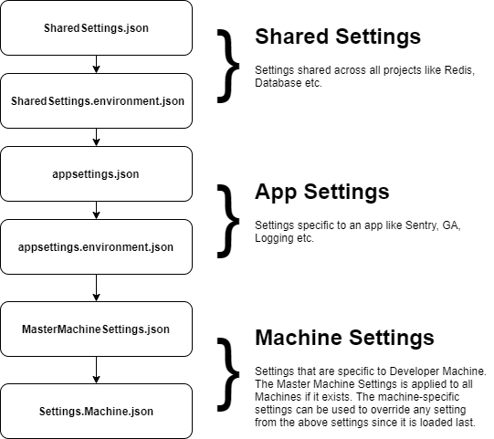

# Folio3 Dotnet Simple Boiler Plate (sbp)


[](https://github.com/ObaidUrRehman/folio3-dotnet-boilerplate/actions/workflows/dotnet.yml) [](https://dev.azure.com/obaid-folio3/Folio3.DotNet.Sbp/_build/latest?definitionId=1&branchName=master)

Sbp is a .NET 5, ASP.NET Core 5, Entity Framework Core 5, C# 9, Simple Boilerplate project. 
Its monolith by nature and is kept as simple as possible and is well architected.

## Getting started
To use this project as a starting point you should execute the `new-project.ps1` script. 
It will ask for you company & project name and rename the entire project (including project, namespace and solution files) into a new folder.

## Features

| Feature                                       | Developer | Status |
| --------------------------------------------- | --------- |--------|
|  Audit Logging                                | Obaid     | ✅ |
|  Audit fields (Created, Modified, Version)    | Munesh    | ✅ |
|  Soft Delete                                  | Munesh    | ✅ |
|  Machine & shared configuration               | Munesh    | ✅ |
|  Lightweight Background Jobs                  | Obaid     | ✅ |
|  Generic Service class                        | Munesh    | ✅ |
|  Generic Exception handling & Respose         | Munesh    | ✅ |
|  Swagger Integration                          | Obaid     | ✅ |
|  JWT Api Auth                                 | Munesh    | ✅ |
|  Structured Logging                           | Munesh    | ✅ |
|  Unit Testing                                 | Munesh    | ✅ |
|  Data seeding                                 |           | ❌ |
|  Validations                                  |           | ❌ |
|  Caching                                      |           | ❌ |
|  Healthchecks                                 |           | ❌ |
|  Email Abstraction with templating            |           | ❌ |

## Audit Logging
Audit Logging utilities allow you to track all changes to a database by capturing changes in the data context and committing those changes to separate Audit Log database.

### Usage
1. Inherit your `DbContext` class from `AuditedDbContext` class
2. Implement the `IAuditMetaData` which determines how you populate information to the trail. Mostly from the user claims.
3. Configure Audit Logging in the startup:
```csharp
services
    .ConfigureAuditLogging<AuditMetaData>(Configuration["ConnectionStrings:auditLog"])
```

## Audit fields
The sample `DbContext` is rigged to populate Audit fields. You can add more fields as required. All entities inherit from `Folio3.Sbp.Data.Common.TrackableEntity`

## Soft Delete
Simply inherit your entity from `Folio3.Sbp.Data.Common.ISoftDeleteEntity` and your entity will be soft-delete only. This feature is implemented using EFCore's [Global Query Filters](https://docs.microsoft.com/en-us/ef/core/querying/filters)

## Machine & shared configuration
This feature lets you:
* Keep all you common configuration accross projects in one place. `(sharedSettings.json)`
* Keep all common enviornment based configuration in one place `(sharedSettings.Development.json)`
* A master machine settings that is applied to all dev machines (You can use this to disable certain stuff on developer machines like sentry, analytics, etc) `(MasterMachineSettings.json)`
* A machine sepecif settings so each developer can have his own configuration (like for database) and does not have to change any other settings. `(Settings.{MachineName}.json)`

The config files are loaded in the following order:



## Lightweight Background Jobs
This is a light weight background job processor based off the [Hosted Service](https://docs.microsoft.com/en-us/aspnet/core/fundamentals/host/hosted-services?view=aspnetcore-5.0&tabs=visual-studio) feature in asp.net core. In the boilerplate sample we use Thread chanels to send a list of Ids to a background worker that processes them. Use this to perform simple tasks (like generating thumbs, sending email etc) where you need to return the response asap to client and not holdup.
This stuff is not generic like Hangfire and is not supposed to run long tasks that consume lots of resources.

## Generic Service class
