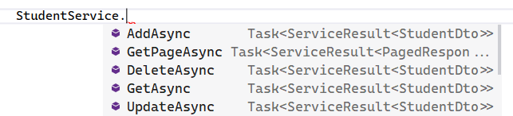

# Folio3 Dotnet Simple Boiler Plate (sbp)


[](https://github.com/ObaidUrRehman/folio3-dotnet-boilerplate/actions/workflows/dotnet.yml) [](https://dev.azure.com/obaid-folio3/Folio3.DotNet.Sbp/_build/latest?definitionId=1&branchName=master)

## Introduction
Sbp is a .NET 5, ASP.NET Core 5, Entity Framework Core 5, C# 9, Simple Boilerplate project. 
Its monolith by nature, well architected and is kept as simple as possible to get you jump started on a new project right away.

## Getting started
To use this project as a starting point run the `new-project.ps1` script. 
It will ask for your company & project name and rename the entire project (including project & solution files along with namespaces etc.) into a new folder.

## Features

| Feature                                       | Developer | Status |
| --------------------------------------------- | --------- |--------|
|  Audit Logging                                | Obaid     | ✅ |
|  Audit fields (Created, Modified, Version)    | Munesh    | ✅ |
|  Soft Delete                                  | Munesh    | ✅ |
|  Machine & shared configuration               | Munesh    | ✅ |
|  Lightweight Background Jobs                  | Obaid     | ✅ |
|  Generic Service class                        | Munesh    | ✅ |
|  Generic Response & Exception handling        | Munesh    | ✅ |
|  Swagger Integration                          | Obaid     | ✅ |
|  JWT Api Auth                                 | Munesh    | ✅ |
|  Structured Logging                           | Munesh    | ✅ |
|  Unit Testing                                 | Munesh    | ✅ |
|  Type Generation                              | Obaid     | ✅ |
|  Data seeding                                 |           | ❌ |
|  Validations                                  |           | ❌ |
|  Caching                                      |           | ❌ |
|  Healthchecks                                 |           | ❌ |
|  Email Abstraction with templating            |           | ❌ |

## Audit Logging
Audit Logging utilities allow you to track all changes to a database by capturing changes in the data context and committing those changes to separate Audit Log database.

### Usage
1. Inherit your `DbContext` class from `AuditedDbContext` class
2. Implement the `IAuditMetaData` which determines how you populate information to the trail. Mostly from the user claims.
3. Configure Audit Logging in the startup:
```csharp
services
    .ConfigureAuditLogging<AuditMetaData>(Configuration["ConnectionStrings:auditLog"])
```

## Audit fields
The sample `DbContext` is rigged to populate Audit fields. You can add more fields as required. All entities inherit from `Folio3.Sbp.Data.Common.TrackableEntity`

## Soft Delete
Simply inherit your entity from `Folio3.Sbp.Data.Common.ISoftDeleteEntity` and your entity will be soft-delete only. This feature is implemented using EFCore's [Global Query Filters](https://docs.microsoft.com/en-us/ef/core/querying/filters)

## Machine & shared configuration
This feature lets you:
* Keep all you common configuration accross projects in one place. `(sharedSettings.json)`
* Keep all common enviornment based configuration in one place `(sharedSettings.Development.json)`
* A master machine settings that is applied to all dev machines (You can use this to disable certain stuff on developer machines like sentry, analytics, etc) `(MasterMachineSettings.json)`
* A machine sepecif settings so each developer can have his own configuration (like for database) and does not have to change any other settings. `(Settings.{MachineName}.json)`

The config files are loaded in the following order:


## Lightweight Background Jobs
This is a light weight background job processor based off the [Hosted Service](https://docs.microsoft.com/en-us/aspnet/core/fundamentals/host/hosted-services?view=aspnetcore-5.0&tabs=visual-studio) feature in asp.net core. In the boilerplate sample we use Thread chanels to send a list of Ids to a background worker that processes them. Use this to perform simple tasks (like generating thumbs, sending email etc) where you need to return the response asap to client and not holdup.
This stuff is not generic like Hangfire and is not supposed to run long tasks that consume lots of resources.

## Generic Service class

```
+-------+    Entity    +----------+  ServiceResult<DTO>  +-------------+ 
|  Db   |  ==========> | Service  |    ==========>       | Controller  |
+-------+              +----------+                      +-------------+ 
```
The `Folio3.Sbp.Service.Base.DbContextService` is a generic base service class that has basic CRUD operation methods. 
This class is inherited by `Folio3.Sbp.Service.Common.Services.BaseService` class that encapsulates these methods by exposing CRUD methods wrapped in a `ServiceResult` class.
The service result class has the following structure:


```csharp
    /// <summary>
    /// Represents the result of a service method call
    /// </summary>
    public class ServiceResult<T>
    {
        public bool Success { get; set; }
        public virtual T Data { get; set; }
        public List<string> Errors { get; set; } = new List<string>();
    }
```
You inherit your service class from the `Folio3.Sbp.Service.Common.Services.BaseService` class. This provides you with the following methods:




The idea is that service layer will retrun a service result that will contain the result of operation. The controller will return appropiate result based on the response of the service layer.

## Generic Response & Exception handling
The controllers are supposed to be lean. Ideally it should be handled by the `Result` method like the following. Notice the lack of exception handler.

```
/// <summary>
/// Adds a new student
/// </summary>
[HttpPost]
public async Task<ResponseDto<StudentDto>> AddStudent([FromBody] StudentDto student)
{
    return Result(await StudentService.AddAsync(student));
}
```
The `Result` method will return the error messages and the appropiate http status code. It is done by a generic error handler middleware `Folio3.Sbp.Api.Middleware.GenericApiErrorHandler`

### Status Codes

The API should return one of the following status codes:

- 200 – response was handled by the server.  We may not have done what was requested, but there is a valid business reason for the request and response.
- 4xx – client error.  The server is fine, but there was something wrong with the clients request
- 400 – Bad Request – use this when in doubt.
- 401 – Authorization failed.  Basically user is not logged in
- 403 – Forbidden – the user is logged in, but they don’t have sufficient privileges.
- 404 – Not found – not only for a bad endpoint, but also if the object requested doesn’t exists.
- 500 – Internal Server Error – the request was (possibly) valid, but the server couldn’t handle the it.

### Development vs Production

In Development, we should return additional status information on Server Errors (e.g. Exception message, call stack, etc.); we should not return this info in Production.  I currently hooked up the “Developer Page” for a pretty page, but I think I will turn this off so the responses are the same in Development and Production, but with Development providing additional diagnostic info.

## TypeScript Type generation
The `Folio3.Sbp.TypeGen` project generates a typescript interface for all api responses from the `Folio3.Sbp.Api` project. 
This file contains all model interfaces. These interfaces can be shared with front-end code to ensure type safety and
model syncronization with frontend apps on React/Vue/Angular etc. For the boilerplate sample the following was generated:

```typescript
export interface PagedResponseDtoOfStudentDto {
    data?: StudentDto[] | undefined;
    pageNumber?: number;
    pageSize?: number;
    totalRecords?: number;
}

export interface StudentDto {
    id?: number;
    firstMidName?: string | undefined;
    lastName?: string | undefined;
    enrollmentDate?: Date;
}
```
Please note that the `Folio3.Sbp.TypeGen` is set to no-build to speedup build time. Please rebuild this project after you make changes to your models.
This feature was made possible using [NSwag MSBuild](https://github.com/RicoSuter/NSwag)
